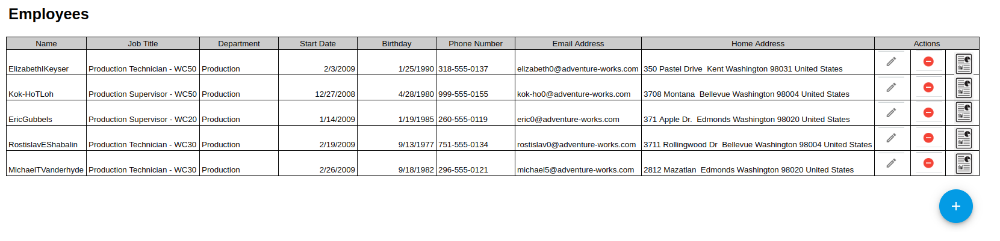
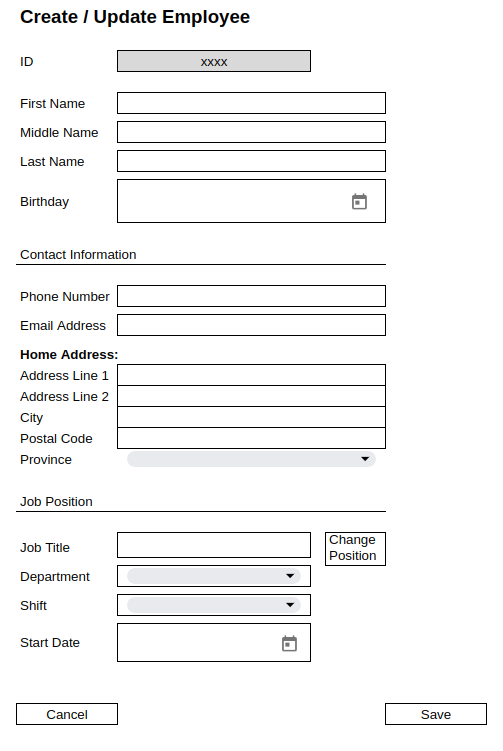
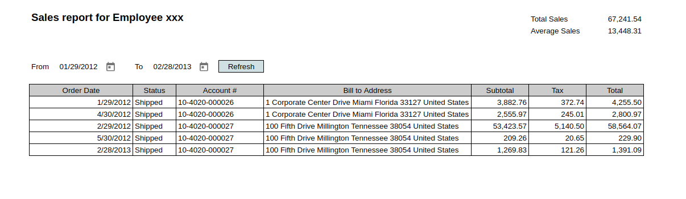

# Adventure Project

Author(s): Karla Sequen

Status: [Ready for review]

Last Updated: 2023-06-27

## Objective

A web application with a CRUD for Employees and a report for sales history using the database Adventure Works

## Goals

- View list of employees
- Add new Employee
- Update existing employee
- Delete existing employee
- View sales report by employee

## Overview

I need an API to get all information from the database and a web application to show the options to the user

Microsoft offers the sample
database "[AdventureWorks](https://learn.microsoft.com/en-us/sql/samples/adventureworks-install-configure?view=sql-server-2017&amp%3Btabs=ssms&tabs=ssms#download-backup-files)"
This database has the schema and data ready to use

## Detailed Design

_____

### High Level Design Diagram:


_____

### Mock up web app

- Employee List



- Modal to create / update employee



- Option to confirm employee deletion


- Sales report by employee



### Database

_____

- ER Diagram https://www.w3resource.com/sql-exercises/adventureworks/index.php

- Get employees list

``` sql
SELECT  t0.BusinessEntityID
        , CONCAT(t1.FirstName, t1.MiddleName, t1.LastName) AS name
        , t0.JobTitle
        , t3.Name                                          AS department
        , t2.StartDate
        , t0.BirthDate
        , t4.PhoneNumber
        , t5.EmailAddress
        , CONCAT(t7.AddressLine1, ' ', t7.AddressLine2, ' ', t7.City, ' ', t8.Name, ' ', t7.PostalCode, ' ',
        t9.Name)                                  AS address
FROM HumanResources.Employee                  t0
JOIN Person.Person                            t1
  ON t0.BusinessEntityID = t1.BusinessEntityID
JOIN HumanResources.EmployeeDepartmentHistory t2
  ON t0.BusinessEntityID = t2.BusinessEntityID
JOIN (
    SELECT BusinessEntityID
        , MAX(StartDate) AS MaxStartDate
    FROM HumanResources.EmployeeDepartmentHistory
    GROUP BY BusinessEntityID) AS           maxdh
  ON t2.BusinessEntityID = maxdh.BusinessEntityID
 AND t2.StartDate = maxdh.MaxStartDate
JOIN HumanResources.Department                t3
  ON t2.DepartmentID = t3.DepartmentID
JOIN Person.PersonPhone                       t4
  ON t1.BusinessEntityID = t4.BusinessEntityID
JOIN Person.EmailAddress                      t5
  ON t1.BusinessEntityID = t5.BusinessEntityID
JOIN Person.BusinessEntityAddress             t6
  ON t6.BusinessEntityID = t0.BusinessEntityID
 AND t6.AddressTypeID = 2 -- Home Address
JOIN Person.Address                           t7
  ON t6.AddressID = t7.AddressID
JOIN Person.StateProvince                     t8
  ON t7.StateProvinceID = t8.StateProvinceID
JOIN Person.CountryRegion                     t9
  ON t8.CountryRegionCode = t9.CountryRegionCode
WHERE t0.CurrentFlag = 1 -- only active employees
;
```

- Delete Employee

We can't delete an employee with DELETE clause, because exist a trigger to prevent that, we only can change de state of
current to 0

```sql
UPDATE HumanResources.Employee
SET CurrentFlag = 0
WHERE BusinessEntityID = {employeeId};
```

- Create/Update Employee

In order to create and update the same information that I use for the get list, I only consider update the next
information:

- Person.Person.FirstName
- Person.Person.MiddleName
- Person.Person.LastName
- HumanResources.Employee.JobTitle
- HumanResources.Employee.BirthDate
- Person.PersonPhone.PhoneNumber
- Person.PersonPhone.ModifiedDate = save the current timestamp
- Person.EmailAddress.EmailAddress
- Person.EmailAddress.ModifiedDate = save the current timestamp

To change department, it's necessary to add new record in HumanResources.EmployeeDepartmentHistory

- HumanResources.EmployeeDepartmentHistory.Department it's necessary to show a drop-down with department list using
  HumanResources.Department
- HumanResources.EmployeeDepartmentHistory.ShiftID show drop-down using HumanResources.Shift
- HumanResources.EmployeeDepartmentHistory.StartDate allow user to select the date
- HumanResources.EmployeeDepartmentHistory.EndDate save as null
- On the last HumanResources.EmployeeDepartmentHistory update the EndDate with a day before the StartDate
- HumanResources.EmployeeDepartmentHistory.ModifiedDate save the current timestamp

To change address

- Person.Address.AddressLine1
- Person.Address.AddressLine2
- Person.Address.City
- Person.Address.PostalCode
- Person.Address.StateProvinceID, show drop-down using Person.StateProvince

_____
**Sales Report**

```sql
SELECT t0.OrderDate
     , CASE
           WHEN t0.Status = 1 THEN 'In process'
           WHEN t0.Status = 2 THEN 'Approved'
           WHEN t0.Status = 3 THEN 'Back Ordered'
           WHEN t0.Status = 4 THEN 'Rejected'
           WHEN t0.Status = 5 THEN 'Shipped'
           WHEN t0.Status = 6 THEN 'Cancelled'
        END                                                                                  AS statusName
     , t0.AccountNumber
     , CONCAT(t1.AddressLine1, ' ', t1.City, ' ', t2.Name, ' ', t1.PostalCode, ' ', t3.Name) AS address
     , t0.SubTotal
     , t0.TaxAmt
     , t0.TotalDue
FROM Sales.SalesOrderHeader t0
         JOIN Person.Address t1
              ON t0.BillToAddressID = t1.AddressID
         JOIN Person.StateProvince t2
              ON t1.StateProvinceID = t2.StateProvinceID
         JOIN Person.CountryRegion t3
              ON t2.CountryRegionCode = t3.CountryRegionCode
WHERE t0.CurrencyRateID IS NULL -- necessary to show only sales from US in $
  AND t0.OrderDate BETWEEN '2012-01-01' AND '2023-01-01'
  AND t0.SalesPersonID = 279; -- employee ID
```

TODO:

- Which date is necessary to use for the filters? OrderDate, DueDate or ShipDate
- For the total includes the Freight value, is it necessary to add that column?

## Solution

### Frontend

- An angular application with one option for Employees, with the option to add, update, delete
- The employee list must have a button to show the sales history report

### Backend

- An API using Java
- SQL Database

____
For the API, I need to add the next endpoints:

| Method | Path                 | Description                                     | Response Code |
|--------|----------------------|-------------------------------------------------|---------------|
| POST   | Employees            | Add new employee                                | 201           |
| PUT    | Employees\\{id}      | Update existing employee                        | 200           |
| DELETE | Employees\\{id}      | delete existing employee                        | 200           |
| GET    | Employees            | Get list of active active                       | 200           |
| GET    | Employee\\{id}\Sales | List of sales report by employee                | 200           |
| GET    | Departments          | Departments List from HumanResources.Department | 200           |
| GET    | Shifts               | Shifts List from HumanResources.Shift           | 200           |
| GET    | Provinces            | Provinces List from Person.StateProvince        | 200           |
